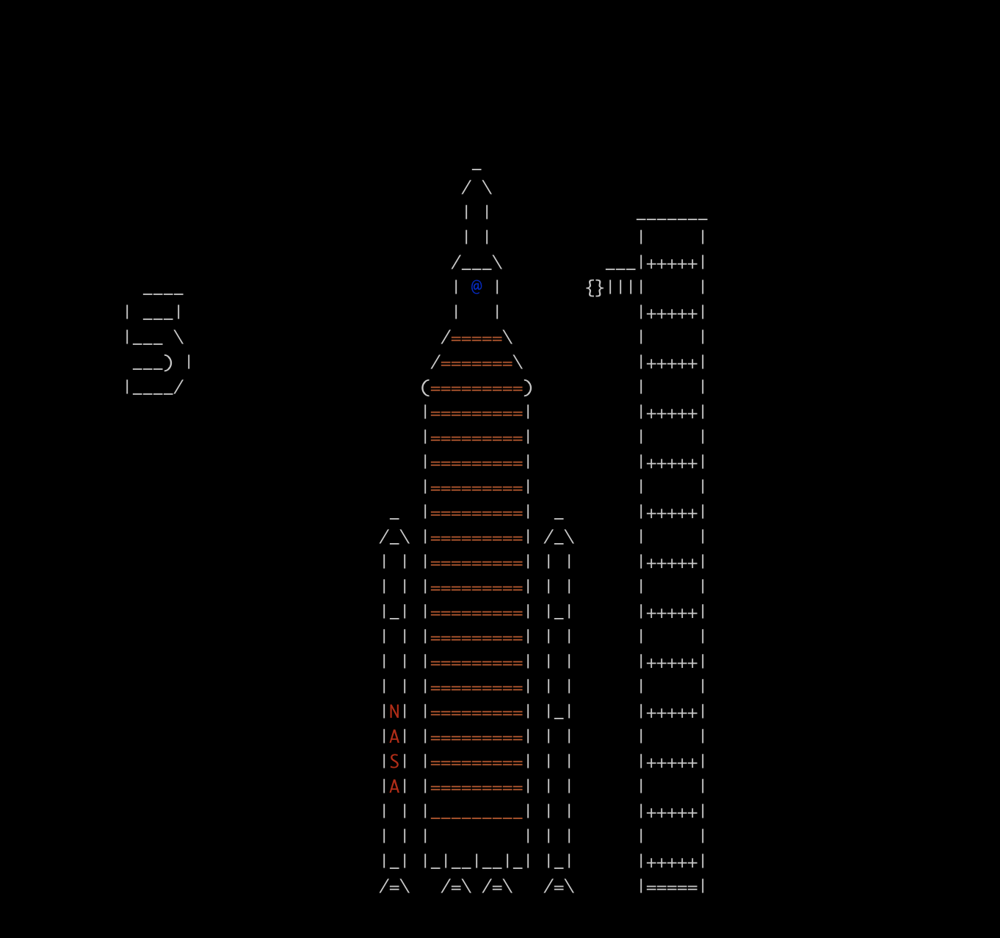

# SLS

An ASCII animation of the SLS, in the spirit of the classic typo-punishing program [`sl`](https://github.com/mtoyoda/sl).




## Build

Requires [`ncurses`](https://invisible-island.net/ncurses/).

Build and run:
```
make sls
./sls
```

Add to your path to see a cute animation if you typo `ls` as `sls` :)

I'll try to get this into `brew`, `apt`, and `yum` at some point in the future.